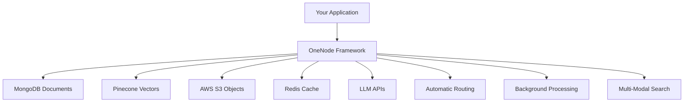

# OneNode

> **Multi-Modal Semantic Search Framework - Your Central Hub for AI Applications**


OneNode is a multi-modal semantic search framework that acts as a central orchestration layer, seamlessly integrating MongoDB, Pinecone, AWS S3, Redis, and Large Language Models into a unified platform. Build powerful AI applications without the infrastructure complexity.

[](https://opensource.org/licenses/MIT)
[](https://pypi.org/project/onenode/)
[](https://www.npmjs.com/package/@onenodehq/onenode)
[](https://console.onenode.ai)

## What is OneNode?

OneNode eliminates the complexity of building multi-modal AI applications by providing a single framework that orchestrates your entire infrastructure stack:

- **🎯 Central Hub**: One API to rule MongoDB, Pinecone, S3, Redis, and LLMs
- **🔍 Multi-Modal Search**: Semantic search across text, images, video, and audio
- **⚡ Auto-Orchestration**: Intelligent routing between storage, vector search, and processing
- **🤖 LLM Integration**: Built-in connections to OpenAI, Anthropic, and more
- **📊 Unified Querying**: MongoDB-compatible API with AI superpowers

## The Setup Nightmare Without OneNode

Building a multi-modal semantic search application traditionally requires:

### Infrastructure Setup (Weeks of Work)
```bash
# MongoDB Setup
- Install and configure MongoDB cluster
- Design document schemas
- Set up indexing strategies
- Configure replication and sharding

# Pinecone Vector Database
- Create Pinecone account and project
- Design vector dimensions and metrics
- Set up multiple indexes for different content types
- Manage embedding generation and upserts

# AWS S3 Object Storage
- Configure S3 buckets with proper permissions
- Set up CDN and access policies
- Implement file upload/download logic
- Handle multipart uploads for large files

# Redis Cache & Queues
- Deploy Redis cluster
- Configure persistence and clustering
- Set up job queues for async processing
- Implement retry logic and dead letter queues

# LLM Integration
- Manage API keys for multiple providers
- Handle rate limiting and failover
- Implement token counting and cost tracking
- Build prompt templates and response parsing
```

### Complex Application Logic
```python
# Without OneNode: 200+ lines of boilerplate
import pymongo
import pinecone
import boto3
import redis
import openai
from celery import Celery

class MultiModalSearch:
    def __init__(self):
        # Initialize 5 different clients
        self.mongo = pymongo.MongoClient(MONGO_URI)
        self.pinecone = pinecone.init(api_key=PINECONE_KEY)
        self.s3 = boto3.client('s3')
        self.redis = redis.Redis(host=REDIS_HOST)
        self.openai = openai.OpenAI(api_key=OPENAI_KEY)
        
    def store_with_search(self, data):
        # 1. Store document in MongoDB
        doc_id = self.mongo.db.collection.insert_one(data)
        
        # 2. Generate embeddings
        embeddings = self.openai.embeddings.create(...)
        
        # 3. Store in Pinecone
        self.pinecone.upsert(vectors=[(doc_id, embeddings)])
        
        # 4. Upload files to S3
        if 'files' in data:
            for file in data['files']:
                self.s3.upload_file(...)
        
        # 5. Cache frequently accessed data
        self.redis.set(f"doc:{doc_id}", json.dumps(data))
        
        # 6. Queue background processing
        process_document.delay(doc_id)
```

### Ongoing Maintenance Burden
- **Monitoring**: Track health of 5+ different services
- **Scaling**: Configure auto-scaling for each component
- **Security**: Manage credentials for multiple providers
- **Updates**: Keep SDKs and dependencies in sync
- **Debugging**: Trace issues across distributed systems
- **Cost Management**: Monitor usage across platforms

## OneNode: One Line, Everything Connected

```python
from onenode import OneNode, Text, Image

# Single initialization - all infrastructure connected
client = OneNode()
db = client.database("my_app")
collection = db.collection("content")

# Multi-modal storage with automatic semantic indexing
content = {
    "title": "AI Research Paper",
    "content": Text("Deep learning transforms computer vision...").enable_index(),
    "diagram": Image("architecture.png").enable_index(),
    "metadata": {"category": "research", "year": 2024}
}

# One call handles: MongoDB storage + Pinecone vectors + S3 upload + Redis cache
doc_id = collection.insert_one(content)

# Semantic search across all modalities
results = collection.query("neural network architectures with diagrams")
```

## Architecture: Central Orchestration Hub

OneNode acts as an intelligent orchestration layer that automatically routes operations to the right backend service:



| Component | OneNode Integration | Your Benefit |
|-----------|-------------------|--------------|
| **MongoDB** | Document storage with auto-indexing | Familiar queries + AI search |
| **Pinecone** | Vector embeddings behind the scenes | Semantic search without complexity |
| **AWS S3** | Automatic file upload/processing | Multimodal content with AI analysis |
| **Redis** | Smart caching and job queues | Performance + async processing |
| **LLMs** | Built-in provider management | AI features without API juggling |

## Key Features

### 🔍 Intelligent Query Routing
```python
# OneNode automatically determines the best search strategy
results = collection.query("show me red sports cars")
# → Combines vector similarity + metadata filters + image analysis
```

### 🖼️ Multi-Modal Content Processing
```python
# Automatic content analysis and indexing
doc = {
    "product": "Tesla Model S",
    "description": Text("Electric luxury sedan").enable_index(),
    "image": Image("tesla.jpg").enable_index(),  # Auto-extracts: "red car, sedan, Tesla logo"
    "video": Video("review.mp4").enable_index()  # Auto-extracts: scenes, speech-to-text
}
collection.insert_one(doc)
```

### ⚡ Background Processing
```python
# Automatic async processing for heavy operations
large_dataset = collection.insert_many(documents)  # Returns immediately
# OneNode handles: embedding generation, image analysis, video processing in background
```

## Use Cases & Examples

### 🤖 RAG Applications
```python
# Build ChatGPT-like apps with your data
knowledge_base = db.collection("docs")
query = "How do I implement authentication?"

# Semantic search + LLM generation in one call
response = knowledge_base.ask(query, model="gpt-4")
```

### 🛒 E-commerce Search
```python
# Visual + text product search
products.query("red running shoes under $100", filters={"category": "footwear"})
```

### 📚 Content Management
```python
# Search across documents, images, videos
content.query("machine learning tutorial with code examples")
```

## Quick Start

### Python
```bash
pip install onenode
```

### JavaScript/TypeScript  
```bash
npm install @onenodehq/onenode
```

```python
from onenode import OneNode

# Initialize - connects to all backend services automatically
client = OneNode()  # Free tier available
db = client.database("my_app")

# Start building immediately
collection = db.collection("products")
collection.insert_one({
    "name": "Wireless Headphones",
    "description": Text("Premium noise-canceling headphones").enable_index()
})

# Semantic search works instantly
results = collection.query("audio equipment for music")
```

## OneNode vs. DIY Infrastructure

| Aspect | Without OneNode | With OneNode |
|--------|-----------------|--------------|
| **Setup Time** | 2-4 weeks | 5 minutes |
| **Lines of Code** | 500+ for basic setup | 10 lines |
| **Services to Manage** | 5+ separate platforms | 1 unified platform |
| **Monthly Maintenance** | 20+ hours | Near zero |
| **Expertise Required** | MongoDB + Pinecone + S3 + Redis + LLM APIs | OneNode API only |
| **Scaling Complexity** | Manual coordination | Automatic |

## Built On Proven Infrastructure

OneNode orchestrates best-in-class services:

- **MongoDB** - Battle-tested document storage
- **Pinecone** - High-performance vector search
- **AWS S3** - Infinitely scalable object storage
- **Redis** - Lightning-fast caching and queues
- **OpenAI/Anthropic** - Leading LLM providers

## Public Beta & Bug Bounty

OneNode is in **public beta**. Help us improve and earn **$10** for each verified bug!

[Report a bug →](https://onenode.ai/contact)

## Documentation & Support

- **[Quick Start Guide](https://docs.onenode.ai)** - Get running in 5 minutes
- **[API Reference](https://docs.onenode.ai/document)** - Complete documentation
- **[Multi-Modal Guide](https://docs.onenode.ai/multimodal)** - Images, video, audio
- **[Dashboard](https://console.onenode.ai)** - Monitor your applications

## Contributing

Found an issue or want to contribute? We'd love your help!

1. **[Report Issues](https://github.com/onenodehq/onenode/issues)**
2. **[Feature Requests](https://github.com/onenodehq/onenode/discussions)**
3. **[Contact Us](https://onenode.ai/contact)**

## License

MIT License - see [LICENSE](LICENSE) for details.

---

<div align="center">

**Stop fighting infrastructure. Start building AI.**

[Get Started Free](https://console.onenode.ai) • [View Docs](https://docs.onenode.ai) • [See Examples](https://docs.onenode.ai/overview)

</div> 