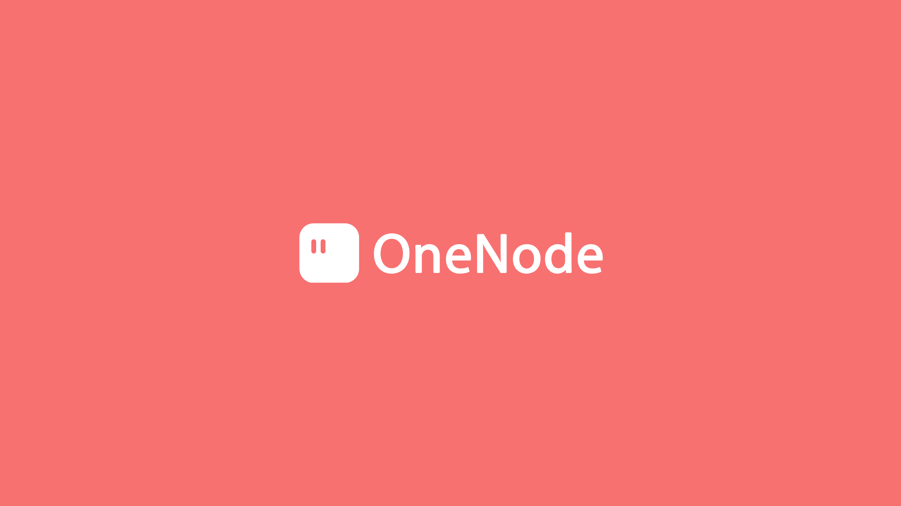
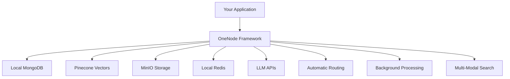

# OneNode Community Edition

> **Multi-Modal Semantic Search Framework - Your Central Hub for AI Applications**



OneNode Community Edition is a semantic search framework that acts as a central orchestration layer, seamlessly integrating MongoDB, Pinecone, S3-compatible storage, Redis, and Large Language Models into a unified platform. Build powerful AI applications with text and image search locally without the infrastructure complexity.

> **Note**: This is the open-source community edition. [Hosted OneNode](https://console.onenode.ai) provides additional enterprise features, managed infrastructure, and enhanced capabilities.

[](https://opensource.org/licenses/MIT)
[](https://pypi.org/project/onenode/)
[](https://www.npmjs.com/package/@onenodehq/onenode)
[](https://console.onenode.ai)

## What is OneNode?

OneNode eliminates the complexity of building multi-modal AI applications by providing a single framework that orchestrates your entire infrastructure stack:

- **🎯 Central Hub**: One API to orchestrate MongoDB, Pinecone, S3-compatible storage, Redis, and LLMs
- **🔍 Multi-Modal Search**: Semantic search across text and images
- **⚡ Auto-Orchestration**: Intelligent routing between storage, vector search, and processing
- **🤖 LLM Integration**: Built-in connections to OpenAI, Anthropic, and more
- **📊 Unified Querying**: MongoDB-compatible API with AI superpowers

## The Setup Nightmare Without OneNode

Building a semantic search application traditionally requires:

### Infrastructure Setup (Weeks of Work)
```bash
# MongoDB Setup
- Install and configure MongoDB cluster
- Design document schemas
- Set up indexing strategies
- Configure replication and sharding

# Pinecone Vector Database
- Create Pinecone account and project
- Design vector dimensions and metrics
- Set up multiple indexes for different content types
- Manage embedding generation and upserts

# S3-Compatible Object Storage
- Set up MinIO or other S3-compatible storage
- Configure buckets with proper permissions
- Set up access policies and credentials
- Implement file upload/download logic
- Handle multipart uploads for large files

# Redis Cache & Queues
- Deploy Redis cluster
- Configure persistence and clustering
- Set up job queues for async processing
- Implement retry logic and dead letter queues

# LLM Integration
- Manage API keys for multiple providers
- Handle rate limiting and failover
- Implement token counting and cost tracking
- Build prompt templates and response parsing
```

### Complex Application Logic
```python
# Without OneNode: 200+ lines of boilerplate
import pymongo
import pinecone
from minio import Minio
import redis
import openai
from celery import Celery

class MultiModalSearch:
    def __init__(self):
        # Initialize 5 different clients
        self.mongo = pymongo.MongoClient(MONGO_URI)
        self.pinecone = pinecone.init(api_key=PINECONE_KEY)
        self.minio = Minio(MINIO_ENDPOINT, access_key=MINIO_KEY, secret_key=MINIO_SECRET)
        self.redis = redis.Redis(host=REDIS_HOST)
        self.openai = openai.OpenAI(api_key=OPENAI_KEY)
        
    def store_with_search(self, data):
        # 1. Store document in MongoDB
        doc_id = self.mongo.db.collection.insert_one(data)
        
        # 2. Generate embeddings
        embeddings = self.openai.embeddings.create(...)
        
        # 3. Store in Pinecone
        self.pinecone.upsert(vectors=[(doc_id, embeddings)])
        
        # 4. Upload files to MinIO
        if 'files' in data:
            for file in data['files']:
                self.minio.put_object(...)
        
        # 5. Cache frequently accessed data
        self.redis.set(f"doc:{doc_id}", json.dumps(data))
        
        # 6. Queue background processing
        process_document.delay(doc_id)
```

### Ongoing Maintenance Burden
- **Monitoring**: Track health of 5+ different services
- **Scaling**: Configure auto-scaling for each component
- **Security**: Manage credentials for multiple providers
- **Updates**: Keep SDKs and dependencies in sync
- **Debugging**: Trace issues across distributed systems
- **Cost Management**: Monitor usage across platforms

## OneNode: Simple API, Everything Connected

```python
import requests
import json

# Single API endpoint - all infrastructure connected
API_BASE = "http://localhost:8000"

# Multi-modal storage with automatic semantic indexing
documents = [{
    "title": "AI Research Paper",
    "content": {
        "xText": {
            "text": "Deep learning transforms computer vision...",
            "index": True
        }
    },
    "diagram": {
        "xImage": {
            "mime_type": "image/png",
            "index": True
        }
    },
    "metadata": {"category": "research", "year": 2024}
}]

# Prepare multipart form data
form_data = {
    'documents': json.dumps(documents)
}
files = {
    'doc_0.diagram.xImage.data': open('architecture.png', 'rb')
}

# One call handles: MongoDB storage + Pinecone vectors + MinIO upload + Redis cache
response = requests.post(
    f"{API_BASE}/v0/project/my_app/db/research/collection/papers/document",
    data=form_data,
    files=files
)

# Semantic search across all modalities
search_data = {
    "query": "neural network architectures with diagrams"
}
search_response = requests.post(
    f"{API_BASE}/v0/project/my_app/db/research/collection/papers/document/query",
    data=search_data
)
results = search_response.json()
```

## Architecture: Central Orchestration Hub

OneNode acts as an intelligent orchestration layer that automatically routes operations to the right backend service:



| Component | OneNode Integration | Your Benefit |
|-----------|-------------------|--------------|
| **MongoDB** | Local document storage with auto-indexing | Familiar queries + AI search |
| **Pinecone** | Vector embeddings behind the scenes | Semantic search without complexity |
| **MinIO** | S3-compatible local object storage | Multimodal content with AI analysis |
| **Redis** | Local smart caching and job queues | Performance + async processing |
| **LLMs** | Built-in provider management | AI features without API juggling |

## Key Features

### 🔍 Intelligent Query Routing
```python
# OneNode automatically determines the best search strategy
search_data = {"query": "show me red sports cars"}
search_response = requests.post(
    f"{API_BASE}/v0/project/my_app/db/inventory/collection/cars/document/query",
    data=search_data
)
# → Combines vector similarity + metadata filters + image analysis
results = search_response.json()
```

### 🖼️ Text and Image Content Processing
```python
# Automatic content analysis and indexing
documents = [{
    "product": "Tesla Model S",
    "description": {
        "xText": {
            "text": "Electric luxury sedan",
            "index": True
        }
    },
    "image": {
        "xImage": {
            "mime_type": "image/jpeg",
            "index": True  # Auto-extracts: "red car, sedan, Tesla logo"
        }
    },

}]

# Prepare multipart form data with files
form_data = {'documents': json.dumps(documents)}
files = {
    'doc_0.image.xImage.data': open('tesla.jpg', 'rb')
}

requests.post(f"{API_BASE}/v0/project/auto/db/products/collection/cars/document", 
              data=form_data, files=files)
```

### ⚡ Background Processing
```python
# Automatic async processing for heavy operations
for doc_list in batch_documents:
    form_data = {'documents': json.dumps(doc_list)}
    requests.post(f"{API_BASE}/v0/project/my_app/db/content/collection/items/document", 
                  data=form_data)
# OneNode handles: embedding generation, image analysis in background
```

## Use Cases & Examples

### 🤖 RAG Applications
```python
# Build ChatGPT-like apps with your data
search_data = {
    "query": "How do I implement authentication?",
    "top_k": "5"
}

# Semantic search for relevant documents
response = requests.post(
    f"{API_BASE}/v0/project/my_app/db/knowledge/collection/docs/document/query",
    data=search_data
)
answer = response.json()
```

### 🛒 E-commerce Search
```python
# Visual + text product search
search_data = {
    "query": "red running shoes under $100",
    "filter": json.dumps({"category": "footwear"})
}
response = requests.post(
    f"{API_BASE}/v0/project/shop/db/inventory/collection/products/document/query",
    data=search_data
)
products = response.json()
```

### 📚 Content Management
```python
# Search across documents and images
search_data = {
    "query": "machine learning tutorial with code examples"
}
response = requests.post(
    f"{API_BASE}/v0/project/edu/db/content/collection/tutorials/document/query",
    data=search_data
)
content = response.json()
```

## Quick Start

### Prerequisites
- Docker and Docker Compose
- OpenAI API Key
- Pinecone API Key

### 1. Environment Setup
```bash
# Clone the repository
git clone https://github.com/onenodehq/onenode.git
cd onenode

# Copy environment template
cp env.example .env

# Add your API keys to .env
OPENAI_API_KEY=your_openai_api_key_here
PINECONE_API_KEY=your_pinecone_api_key_here
```

### 2. Start with Docker Compose
```bash
# Start all services (MongoDB, Redis, MinIO, OneNode)
docker-compose up -d

# OneNode API will be available at http://localhost:8000
# MinIO Console at http://localhost:9001 (minioadmin/minioadmin)
# MongoDB at localhost:27017
```

### 3. Start Building with Direct API Calls

The OneNode Community Edition uses direct API endpoints. The hosted OneNode SDKs are not compatible with this local version.

#### Python Example
```python
import requests
import json

# OneNode API base URL
API_BASE = "http://localhost:8000"

# Insert a document with semantic indexing
documents = [{
    "name": "Wireless Headphones",
    "description": {
        "xText": {
            "text": "Premium noise-canceling headphones",
            "index": True
        }
    }
}]

# Prepare multipart form data
form_data = {
    'documents': json.dumps(documents)
}

response = requests.post(
    f"{API_BASE}/v0/project/my_app/db/products/collection/items/document",
    data=form_data
)

# Semantic search
search_data = {
    "query": "audio equipment for music"
}

results = requests.post(
    f"{API_BASE}/v0/project/my_app/db/products/collection/items/document/query",
    data=search_data
)

print(results.json())
```

#### JavaScript Example
```javascript
const API_BASE = "http://localhost:8000";

// Insert a document with semantic indexing
const documents = [{
    name: "Wireless Headphones",
    description: {
        xText: {
            text: "Premium noise-canceling headphones",
            index: true
        }
    }
}];

// Prepare multipart form data
const formData = new FormData();
formData.append('documents', JSON.stringify(documents));

const response = await fetch(`${API_BASE}/v0/project/my_app/db/products/collection/items/document`, {
    method: 'POST',
    body: formData
});

// Semantic search
const searchData = new FormData();
searchData.append('query', 'audio equipment for music');

const results = await fetch(`${API_BASE}/v0/project/my_app/db/products/collection/items/document/query`, {
    method: 'POST',
    body: searchData
});

const data = await results.json();
console.log(data);
```

## OneNode vs. DIY Infrastructure

| Aspect | Without OneNode | With OneNode |
|--------|-----------------|--------------|
| **Setup Time** | 2-4 weeks | 5 minutes |
| **Lines of Code** | 500+ for basic setup | 10 lines |
| **Services to Manage** | 5+ separate platforms | 1 unified platform |
| **Monthly Maintenance** | 20+ hours | Near zero |
| **Expertise Required** | MongoDB + Pinecone + S3 + Redis + LLM APIs | OneNode API only |
| **Scaling Complexity** | Manual coordination | Automatic |

## Built On Proven Infrastructure

OneNode Community Edition orchestrates best-in-class services locally:

- **MongoDB** - Battle-tested document storage (local instance)
- **Pinecone** - High-performance vector search (cloud service)
- **MinIO** - S3-compatible object storage (local instance)
- **Redis** - Lightning-fast caching and queues (local instance)
- **OpenAI/Anthropic** - Leading LLM providers (cloud APIs)

## Public Beta & Bug Bounty

OneNode is in **public beta**. Help us improve and earn **$10** for each verified bug!

[Report a bug →](https://onenode.ai/contact)

## Documentation & Support

- **[Quick Start Guide](https://docs.onenode.ai)** - Get running in 5 minutes
- **[API Reference](https://docs.onenode.ai/document)** - Complete documentation
- **[Multi-Modal Guide](https://docs.onenode.ai/multimodal)** - Text and image processing
- **[Dashboard](https://console.onenode.ai)** - Monitor your applications

## Contributing

Found an issue or want to contribute? We'd love your help!

1. **[Report Issues](https://github.com/onenodehq/onenode/issues)**
2. **[Feature Requests](https://github.com/onenodehq/onenode/discussions)**
3. **[Contact Us](https://onenode.ai/contact)**

## License

MIT License - see [LICENSE](LICENSE) for details.

---

<div align="center">

**Stop fighting infrastructure. Start building AI.**

[Get Started Locally](#quick-start) • [View Docs](https://docs.onenode.ai) • [Hosted Version](https://console.onenode.ai)

</div> 